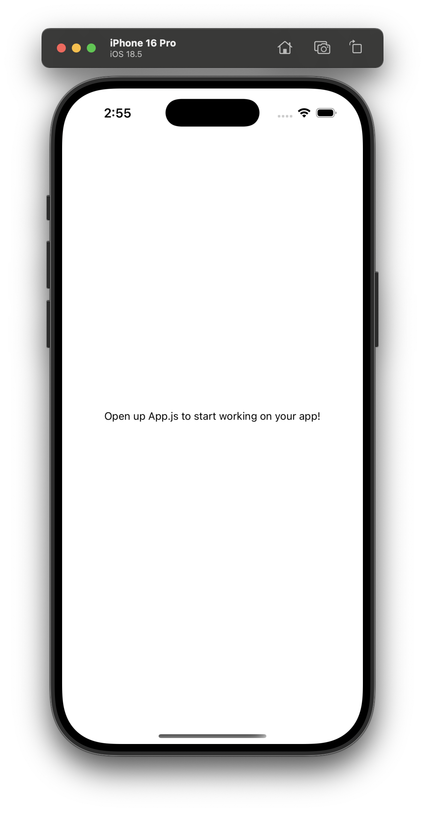

# 프로젝트 생성

## `expo init reminote`

```shell
➜  Projects expo init reminote
WARNING: The legacy expo-cli does not support Node +17. Migrate to the new local Expo CLI: https://blog.expo.dev/the-new-expo-cli-f4250d8e3421.
┌───────────────────────────────────────────────────────────────────────────┐
│                                                                           │
│   The global expo-cli package has been deprecated.                        │
│                                                                           │
│   The new Expo CLI is now bundled in your project in the expo package.    │
│   Learn more: https://blog.expo.dev/the-new-expo-cli-f4250d8e3421.        │
│                                                                           │
│   To use the local CLI instead (recommended in SDK 46 and higher), run:   │
│   › npx expo <command>                                                    │
│                                                                           │
└───────────────────────────────────────────────────────────────────────────┘

Migrate to using:
› npx create-expo-app --template

✖ Choose a template: › minimal             bare and minimal, just the essentials to get you started
➜  Projects npx create-expo-app reminote --template blank
Creating an Expo project using the blank template.

✔ Downloaded and extracted project files.
> npm install
npm warn deprecated inflight@1.0.6: This module is not supported, and leaks memory. Do not use it. Check out lru-cache if you want a good and tested way to coalesce async requests by a key value, which is much more comprehensive and powerful.
npm warn deprecated rimraf@3.0.2: Rimraf versions prior to v4 are no longer supported
npm warn deprecated glob@7.2.3: Glob versions prior to v9 are no longer supported
npm warn deprecated glob@7.2.3: Glob versions prior to v9 are no longer supported
npm warn deprecated glob@7.2.3: Glob versions prior to v9 are no longer supported
npm warn deprecated glob@7.2.3: Glob versions prior to v9 are no longer supported

added 659 packages, and audited 660 packages in 47s

69 packages are looking for funding
  run `npm fund` for details

found 0 vulnerabilities

✅ Your project is ready!

To run your project, navigate to the directory and run one of the following npm commands.

- cd reminote
- npm run android
- npm run ios
- npm run web
```

## `npm run ios`

```
➜  reminote git:(main) ✗ cd ..
➜  Projects cd reminote
➜  reminote git:(main) ✗ npm run ios

> reminote@1.0.0 ios
> expo start --ios

Starting project at /Users/minah.kim/Projects/reminote
Starting Metro Bundler
› Opening exp://192.168.100.75:8081 on iPhone 16 Pro
Downloading the Expo Go app [================================================================] 100% 0.0s

▄▄▄▄▄▄▄▄▄▄▄▄▄▄▄▄▄▄▄▄▄▄▄▄▄▄▄
█ ▄▄▄▄▄ █ ▀▀▄ ▀ █▄█ ▄▄▄▄▄ █
█ █   █ ███ ▄▄ ▄▄ █ █   █ █
█ █▄▄▄█ █ ▄▄ █ ▀█▄█ █▄▄▄█ █
█▄▄▄▄▄▄▄█ █ ▀ █ █▄█▄▄▄▄▄▄▄█
█▄ ▄█▀▄▄█   ███  █▄ ▄▄██  █
█▀ ▀  █▄▄█▀█▄█▄▀▄██▀▄█▄▄█▄█
█▄██ ▀▄▄▀█▄█▄ ▀  █  ███▀ ▀█
█▄▄ ▀▄▀▄  ██▀ █▄   ▄█ ▄█▀▄█
█▄▄▄█▄█▄█ ▀ █▄▀ █ ▄▄▄  ▀█ █
█ ▄▄▄▄▄ █▀ ▀▄█▄▄█ █▄█ ██▀▄█
█ █   █ ██ ▀ ██ ▄▄▄▄   ▀ ██
█ █▄▄▄█ █ █▀▄▄▄▄ ▀▀█ ▄██▄▄█
█▄▄▄▄▄▄▄█▄▄▄███▄▄▄▄█▄▄███▄█

› Metro waiting on exp://192.168.100.75:8081
› Scan the QR code above with Expo Go (Android) or the Camera app (iOS)

› Using Expo Go
› Press s │ switch to development build

› Press a │ open Android
› Press i │ open iOS simulator
› Press w │ open web

› Press j │ open debugger
› Press r │ reload app
› Press m │ toggle menu
› shift+m │ more tools
› Press o │ open project code in your editor

› Press ? │ show all commands

Logs for your project will appear below. Press Ctrl+C to exit.
› Opening the iOS simulator, this might take a moment.
iOS Bundled 5405ms index.js (671 modules)
iOS Bundled 44ms index.js (1 module)
```

아래와 같이 시뮬레이터가 구동된다.



```
my-app/
├── src/
│   ├── components/        # 재사용 가능한 컴포넌트
│   ├── screens/           # 페이지 단위 컴포넌트 (예: HomeScreen.js)
│   ├── navigation/        # React Navigation 설정
│   ├── hooks/             # 커스텀 훅
│   └── utils/             # 유틸 함수
├── assets/                # 이미지, 폰트 등 정적 자산
├── node_modules/          # 설치된 npm 패키지
├── .expo/                 # Expo 관련 내부 설정 (로컬에서만 사용됨)
├── .gitignore             # Git에서 무시할 파일 목록
├── app.json               # Expo 앱 설정 (앱 이름, 아이콘, 스플래시 등)
├── app.config.js (선택)    # app.json 대신 JS로 동적 설정할 때 사용
├── babel.config.js        # Babel 설정
├── package.json           # 의존성, 스크립트, 메타정보
├── App.js                 # 앱의 진입점 컴포넌트
└── README.md              # 프로젝트 설명
```

# 앱스토어 등록

## ✅ 전체 흐름 요약 (iOS 기준)

```
scss


CopyEdit
[1] Apple 개발자 계정 가입
[2] 앱 스토어용 앱 정보 등록 (App Store Connect)
[3] Expo 앱 빌드
[4] 앱 스토어에 업로드
[5] 심사 → 승인 → 배포
```

------

## 1. 🍏 Apple 개발자 계정 가입

- https://developer.apple.com
- 개인 또는 회사 계정 생성
- 연간 $99 (개인 계정이면 개인명으로 배포됨)

------

## 2. 📋 App Store Connect에 앱 등록

- https://appstoreconnect.apple.com
- "My Apps" → `+` 버튼 → New App 생성
  - 앱 이름, 번들 ID, 플랫폼(iOS), 언어 등 입력


📌 번들 ID는 Expo `app.json` 또는 `app.config.js`에 적어야 해요:

```
json


CopyEdit
{
  "expo": {
    "ios": {
      "bundleIdentifier": "com.minakim.myapp"
    }
  }
}
```

------

## 3. 🛠️ 앱 빌드 (Expo)

Expo는 EAS(Build)라는 툴을 통해 배포용 `.ipa` 파일을 만들어줍니다.

### 3-1. EAS CLI 설치

```shell
npm install -g eas-cli
```

### 3-2. Expo 계정 로그인

```shell
eas login
```

### 3-3. EAS 프로젝트 초기화

```shell
eas build:configure
```

### 3-4. iOS 앱 빌드

```shell
eas build --platform ios
```

- Expo가 알아서 인증서, 프로파일 등을 관리해줌
- 빌드 완료되면 다운로드 링크를 줍니다

------

## 4. ☁️ 앱 업로드 (Transporter 사용)

- Transporter 앱 (Mac App Store) 설치
- `.ipa` 파일을 Drag & Drop 해서 업로드
- 업로드 완료되면 App Store Connect에 빌드가 표시됨

------

## 5. ✅ 심사 및 배포

- App Store Connect → 앱 상세 페이지 → 제출(Submit for Review)
- 심사 완료 후 승인되면 앱스토어에 자동 배포됨

------

## 🔐 참고: 앱스토어 제출 전에 준비할 것

| 항목               | 설명                                                   |
| ------------------ | ------------------------------------------------------ |
| 앱 아이콘          | `1024x1024` PNG (배경 불투명)                          |
| 스크린샷           | iPhone 6.7", 6.1" 등용 최소 3장                        |
| 개인정보 정책 링크 | 필요함 (외부 웹페이지 링크 또는 App Store에 직접 작성) |
| 앱 설명/키워드     | 한글/영문 둘 다 가능                                   |

